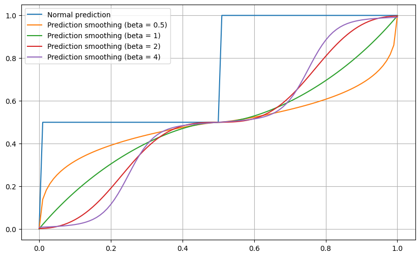

# DecisionTree

A customizable implementation of decision trees for regression, written from scratch with flexible loss functions and visualization tools.

---

## Updates

- **0.0.4**
    - Smooth prediction.

- **0.0.5**
    - Save and load function.
    
- **0.0.6**
    - Faster plot_sensitivity.

- **0.0.7**
    - Tree search option in train.

---

## Download

```bash
pip install git+https://github.com/IanAguiar-ai/free_decision_tree
```

---

## Inputs

When creating a `DecisionTree`, you can specify:

- **data** (`pd.DataFrame`): Input dataset (features + target column).
- **y** (`str`): Name of the target column.
- **max_depth** (`int`, default=`3`): Maximum depth of the tree.
- **min_samples** (`int`, default=`1`): Minimum samples required in a node.
- **loss_function** (`callable`, default=`simple_loss`): Function used to compute individual losses.
- **loss_calc** (`callable`, default=`calc_loss`): Function used to combine losses from splits.
- **plot** (`Plot`, optional): Progress bar handler; if `None`, a default progress loader is used.
- **train** (`bool`, default=`True`): If `True`, trains the tree at initialization.
- **depth** (`int`, internal): Current depth (automatically managed during recursion).
- **print** (`bool`, default=`False`): Enables verbose logging during training and prediction.
- **optimized** (`int`, default=`-1`): Step size for tested split points (reduces computation).

---

## Use

### Example

```python
import pandas as pd
from free_decision_tree import DecisionTree

# Example dataset
df = pd.DataFrame({
    "x1": [1, 2, 3, 4, 5],
    "x2": [2, 1, 4, 3, 5],
    "y":  [1.2, 1.9, 3.1, 3.9, 5.1]
})

# Train tree
tree = DecisionTree(df, y="y", max_depth=2, min_samples=1)

# Print structure
print(tree)
```

Output:

```python
DataFrame:
    Columns of DataFrame (X): x1, x2
    y: y
    Len of Dataframe: 5

Values:
    Depth: root
    Division in: x1
    In value: <= 2.0
    Self loss: 9.671999999999997
    Loss in division: 2.271666666666666

Variables:
    Min Samples: 1
    Max Depth: 2
    optimized: False

Functions:
    Loss Function: simple_loss
    Join Loss: calc_loss

Output: 3.04
```

---

### Train

Method 1:

```python
from free_decision_tree import DecisionTree

# Train tree
tree = DecisionTree(df, y="y", max_depth=2, min_samples=1)
```

Method 2:

```python
from free_decision_tree import DecisionTree

# Train tree
tree = DecisionTree(df, y="y", max_depth=2, min_samples=1, train=False)
tree.train()
```

There are two training algorithms, the traditional one which takes longer and the tree search one. By default, the traditional one is used, but if you want a faster one and want to ensure that the loss functions are convex, you can use the tree search one. It is recommended that you test both to understand the differences.

```python
from free_decision_tree import DecisionTree

# Train tree
tree = DecisionTree(df, y="y", max_depth=2, min_samples=1, tree_search=True)
```

This method has a parameter called `tree_search` that controls how smooth the method will be, the higher the value the slower it will be, but in return the more accurate it can be (as long as the loss function is convex). Values ​​between 1 and 6 are recommended, being an integer.

```python
from free_decision_tree import DecisionTree

# Train tree
tree = DecisionTree(df, y="y", max_depth=2, min_samples=1, tree_search=True, tree_search_w=3)
```

---

### Prediction

```python
# Predict on new data
X_test = pd.DataFrame({"x1": [2.5], "x2": [3.0]})
prediction = tree.predict(X_test)

print(prediction)  # Returns float or list of floats
```

You can also call the tree directly:

```python
prediction = tree(X_test)
```

If you don't want the prediction to reach the leaf, there is a parameter called `max_depth` that controls the maximum depth of the output.

```python
# Predict on new data
X_test = pd.DataFrame({"x1": [2.5], "x2": [3.0]})
prediction = tree.predict(X_test, max_depth=2)

print(prediction)  # Returns float or list of floats
```

---

### Predict smooth

```python
tree.predict_smooth(X_test, n_neighbors=None, alpha=0.001)
```

Performs prediction with a **smoothing technique based on nearest neighbors** of the leaves.
Instead of returning only the raw leaf output, it:

1. Calls `detect_depth()` (if not already computed) to build a table of leaves and their average positions/outputs.
2. For each row in `X_test`, computes the Euclidean distance to each averaged leaf centroid.
3. Selects the *n_neighbors* closest leaves (default = number of features + 1).
4. Applies distance-weighted averaging using parameter `alpha` to avoid division by zero.

Parameters:
- **`X_test`** (`pd.DataFrame`): Input data for prediction.
- **`n_neighbors`** (`int`, optional): Number of neighbors to consider; defaults to `len(leafs)`.
- **`alpha`** (`float`, default=`0.001`): Smoothing factor to stabilize weights.
- **`beta`** (`float`, default=`2`): Regularization factor.

Returns:
- A single float if one row is passed, or a list of floats otherwise.

This method is recommended when predictions should be less sensitive to sharp splits of the tree, approximating a smoother regression surface.

Formula:

$$ f(X) = \frac{ \sum_{i}^{len(X)} \left( \frac{1}{\alpha + \min_j \left( Distance(\hat{X_j}, X_i) \right)^{\beta}} \cdot \hat{y}_i \right)}{\sum_{i}^{len(X)} \frac{1}{\alpha + \min_j \left( Distance(\hat{X_j}, X_i) \right)^{\beta}}} $$

Example:

```python
from free_decision_tree import DecisionTree
import pandas as pd
import seaborn as sns
from sklearn.preprocessing import StandardScaler

df = sns.load_dataset("flights")  # ou "tips", "titanic", "penguins", etc.
meses:list = [mes for mes in df["month"].iloc[:12]]
df["month"] = df["month"].replace({mes:int(i+1) for i, mes in enumerate(meses)})
df["month"] = df["month"].astype(int)

def simple_loss_1(y:pd.DataFrame) -> float:
    y_:float = y.mean()
    return 1/len(y) * sum([(y_i - y_)*(y_i - y_) for y_i in y])

model = DecisionTree(data = df.iloc[::2], y = "passengers", max_depth = 4,
                     loss_function = simple_loss_1, loss_calc = lambda a, b : max(a, b))
                     
def simple_loss_2(y:pd.DataFrame) -> float:
    y_:float = y.mean()
    return sum([(y_i - y_)*(y_i - y_) for y_i in y])

model2 = DecisionTree(data = df.iloc[::2], y = "passengers", max_depth = 4, loss_calc = lambda a, b : a + b, loss_function = simple_loss_2)

def simple_loss_3(y:pd.DataFrame) -> float:
    y_:float = y.mean()
    return sum([(y_i - y_)**8 for y_i in y])

model3 = DecisionTree(data = df.iloc[::2], y = "passengers", max_depth = 4, min_samples = 1,
                      loss_function = simple_loss_3, loss_calc = lambda a, b : max(a, b))
                      
import matplotlib.pyplot as plt

df_temp = df[df["year"] >= 1949]
X = [df_temp["month"].iloc[i]/12 + df_temp["year"].iloc[i] for i in range(len(df_temp))]

plt.figure(figsize = (14, 7))
plt.plot(X, model(df_temp), color = "blue", label = "Predito (Modelo 1)", alpha = 0.7)
plt.plot(X, model2(df_temp), color = "green", label = "Predito (Modelo 2)", alpha = 0.7)
plt.plot(X, model3(df_temp), color = "orange", label = "Predito (Modelo 3)", alpha = 0.7)
plt.plot(X, model3.predict_smooth(df_temp, n_neighbors = 3), color = "purple", linestyle = "--", label = "Predito (Modelo 3 com técnica de smooth)", alpha = 0.7)

plt.plot(X, df_temp["passengers"], color = "red", linestyle = "--", label = "Real")

plt.xlabel("Ano")
plt.ylabel("Passageiros")
plt.grid()
plt.legend()
plt.show()
```


```python
from free_decision_tree import DecisionTree
import matplotlib.pyplot as plt

dt = pd.DataFrame({"a":[0, .5, 1],
                   "b":[0, .5, 1]})

model = DecisionTree(data = dt, y = "b", max_depth = 2, min_samples = 1)

dt_test = pd.DataFrame({"a":[i/100 for i in range(101)]})

y_ = model.predict(dt_test)


plt.figure(figsize = (10, 6))
plt.plot(dt_test["a"], y_, label = "Predição normal")
for beta in [0.5, 1, 2, 4]:
  y_ = model.predict_smooth(dt_test, beta = beta)
  plt.plot(dt_test["a"], y_, label = f"Predição com smoothing e beta = {beta}")
plt.legend()
plt.show()
```



```python
from free_decision_tree import DecisionTree
import pandas as pd
import matplotlib.pyplot as plt
from mpl_toolkits.mplot3d import Axes3D
from random import random, seed
import numpy as np


# Dados
seed(1)
df = pd.DataFrame({"a": [*[0, 1, 0, 1], *[1 + random() - 0.5 for _ in range(10)]],
                   "b": [*[0, 0, 1, 1], *[1 + random() - 0.5 for _ in range(10)]],
                   "c": [*[0, 1, -1, 2], *[2 + random() / 10 for _ in range(10)]]})

model = DecisionTree(data = df, y = "c", max_depth = 2, min_samples = 1)
model.plot_tree()

df_test = pd.DataFrame({"a": [(i / 101) % 2 - 1 for i in range(5000)],
                        "b": [(i / 107) % 2 - 1for i in range(5000)]})

def plot_3d(df, y, title):
    fig = plt.figure(figsize=(8, 6))
    ax = fig.add_subplot(111, projection='3d')
    ax.scatter(df["a"], df["b"], y, c=y, cmap='viridis', alpha=0.8)
    ax.set_xlabel("a")
    ax.set_ylabel("b")
    ax.set_zlabel("Predição")
    ax.set_title(title)
    plt.show()

y = model.predict(df_test)
plot_3d(df_test, y, "Decision Tree")

y = model.predict_smooth(df_test, beta=1, representatives = True)
plot_3d(df_test, y, "Decision Tree Smooth (beta = 1)")

y = model.predict_smooth(df_test, beta=2, representatives = True)
plot_3d(df_test, y, "Decision Tree Smooth (beta = 2)")
```


---

### Detect depth

```python
tree.detect_depth()
```

Generates a new `DataFrame` containing metadata about each sample in the training set:
- **`__dt_depth__`**: the depth of the node in which the sample ended up.
- **`__dt_leaf__`**: the identifier of the leaf reached by the sample.
- **`__dt_y__`**: the predicted output value for the sample.

This is useful to analyze how samples are distributed across the tree, debug overfitting, or prepare structures for smoothing techniques.

Returns:
- A copy of the training `DataFrame` with the additional diagnostic columns.

---

### Save and Load DecisionTree

To save:

```python
your_model.save(string_name_to_save)
```

To load:

```python
new_model:DecisionTree = DecisionTree.load(string_name_to_save)
```

Example:

```python
from free_decision_tree import DecisionTree
import seaborn as sns
import pandas as pd
    
df = sns.load_dataset("flights")  # ou "tips", "titanic", "penguins", etc.
meses:list = [mes for mes in df["month"].iloc[:12]]
df["month"] = df["month"].replace({mes:int(i+1) for i, mes in enumerate(meses)})
df["month"] = df["month"].astype(int)

def simple_loss_3(y:pd.DataFrame) -> float:
    y_:float = y.mean()
    return sum([(y_i - y_)**8 for y_i in y])

model3 = DecisionTree(data = df.iloc[::2], y = "passengers", max_depth = 5, min_samples = 1,
                      loss_function = simple_loss_3)
model3.plot_tree()

model3.save("test")

new_model = DecisionTree.load("test")
new_model.plot_tree()
```

---

### Plot tree

```python
tree.plot_tree()
```

Generates a visual representation of the decision tree, with splits, sample counts, losses, and outputs at each node.

Example:

```python
from free_decision_tree import DecisionTree
import pandas as pd
import seaborn as sns

df = sns.load_dataset("iris")  # ou "tips", "titanic", "penguins", etc.
df = df.drop(columns = ["species"])

model = DecisionTree(data = df, y = "petal_length", max_depth = 3, min_samples = 2)
print(model)
```

```
DataFrame:
    Columns of DataFrame (X): sepal_length, sepal_width, petal_width
    y: petal_length
    Len of Dataframe: 150

Values:
    Depth: root
    Division in: petal_width
    In value: <= 0.6
    Self loss: 464.32540000000046
    Loss in division: 68.95420000000001

Variables:
    Min Samples: 2
    Max Depth: 3
    optimized: False

Functions:
    Loss Function: simple_loss
    Join Loss: calc_loss

Output: 3.7580000000000005
```

```python
model.plot_tree()
```


---

### Plot sensitivity

```python
tree.plot_sensitivity(train=df, test=df, y="y")
```

Performs a sensitivity test over different depths.
Outputs:
- MSE (train vs. test) for each depth.
- A plot with the optimal depth (minimum test error).
- Returns the best depth as `int`.

---

### Plot confidence interval

```python
tree.plot_ci(test=df, y="y", confidence=0.95)
```

Generates a scatter plot of predicted vs. real values with confidence intervals.
Returns the approximate confidence error value (`float`).

Example:

```python
from free_decision_tree import DecisionTree
import pandas as pd
import seaborn as sns

df = sns.load_dataset("iris")  # ou "tips", "titanic", "penguins", etc.
df = df.drop(columns = ["species"])

model = DecisionTree(data = df, y = "petal_length", max_depth = 3, min_samples = 2)
model.plot_ci()
```


---

## Modifiable parts

- **Individual losses** (`loss_function`)
  By default, variance loss (`simple_loss`). Can be replaced with custom metrics (e.g., entropy, Gini).

```python
def simple_loss(y:pd.DataFrame) -> float:
    y_:float = y.mean()
    return sum([(y_i - y_)*(y_i - y_) for y_i in y])
```

- **Merging of losses** (`loss_calc`)
  By default, additive (`calc_loss`). Can be changed to `max`, weighted average, etc.

```python
def calc_loss(loss_1:float, loss_2:float) -> float:
    return loss_1 + loss_2 #max(loss_1, loss_2)
```

- **Function to prediction in leaf** (`function_prediction_leaf`)
  By default, additive (`mean`). Can be changed.
 
```python
def mean(dt:pd.DataFrame):
    return dt.mean()
```

---

## Structure

- **`DecisionTree`**: Main class (training, prediction, visualization).
- **`Plot`**: Progress bar utility.
- **`simple_loss(y)`**: Default variance-based loss.
- **`calc_loss(loss_1, loss_2)`**: Default method to merge losses.
